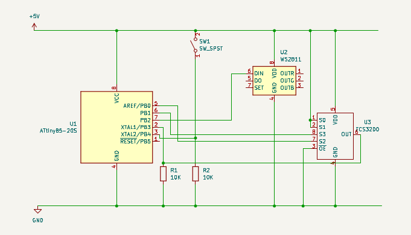
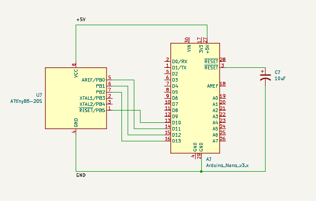

# Color Catcher
An Attiny85 based color sensing desk lamp.

## Setup
### Components
- Attiny85
- WS2811 / WS2812 based addressable RGB LED
- TCS230 (TCS3200) color sensor
- Arduino nano (or other variants) as ISP
- 2 x 10k resistors
- 1 x SPST switch
- Wires, breadboard / perfboard, 5V power supply

    

### Programming
An Arduino can be used as an in-system programmer (ISP). Arduino nano is used as an example here.
1. Upload the *ArduinoISP* sketch from **Examples** to an Arduino nano.
2. Connect Attiny85 to Arduino.
    

        
    

3. Add [http://drazzy.com/package_drazzy.com_index.json](http://drazzy.com/package_drazzy.com_index.json) to the *Additional Boards Manager URLs* under *Preferences* and install AttinyCore.
4. Choose Attiny25/45/85 (No bootloader) from the board selection menu and burn bootloader.
5. Install Adafruit Neopixel library and upload *color-catcher.ino* sketch.
